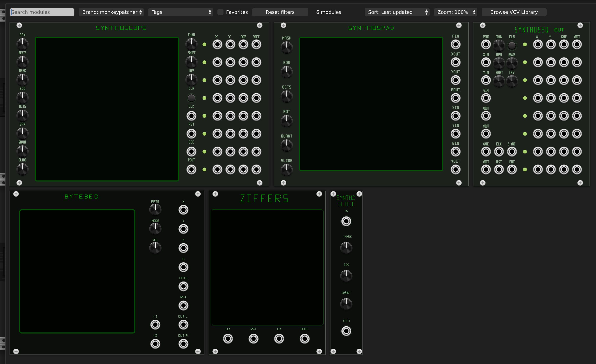
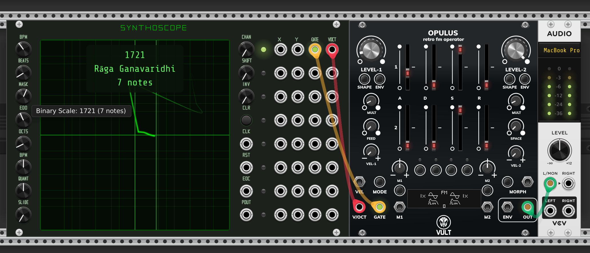
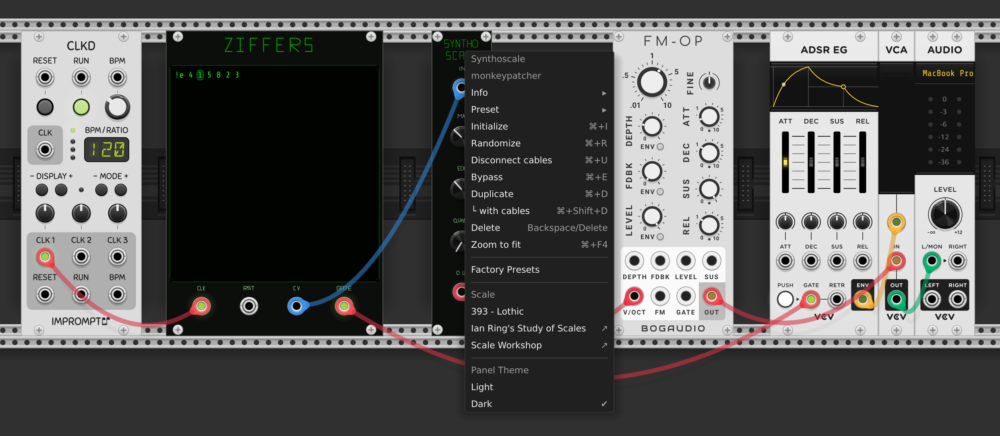

# monkeypatcher

Experimental prototype monkeypatcher modules for VCVRACK2. Released for testing and feedback:

# Installation

This prototype is distributed as .vcvplugin file. Download the monkeypatcher-2.0.0-mac-arm64.vcv file and store it to your vcv2 plugins directory:

* MacOS: ~/Library/Application Support/Rack2/
* Windows: C:\Users\<username>\AppData\Local\Rack2\
* Linux: ~/.local/share/Rack2/

Rack will extract and load the plugin upon launch.

See Official docs for third-party plugins: https://vcvrack.com/manual/Installing#Installing-plugins-not-available-on-the-VCV-Library

Its all fine. Trust the monkey.

# Included modules

## Synthoscope

Funny isometric xy scale pad based on synthoscope.com

## Synthospad

Simpler pad without integrated looper. Meant to be used with Synthoseq or as simple controller.

## Synthoseq

Simple 8 track xy looper / sequencer

## Bytebed

Funky bytebeat interpreter based on bytebed.com

## Ziffers

Modular version of Ziffers - The numerical live coding notation.

Base 62 variant notation for pitch classes / scale degrees (0..Z = 0..9, a-z, A-Z).

Durations denoted with !-mark and fractions, decimals or characters (q, w, e, s, etc.), for example !1/4, !0.25 or !q.

## Synthoscale

Standalone binary mask scale quantizer for binary and MOS scales. Designed especially for Ziffers live coding module, but works with other sequencers, like Seq-3 as well.

# Credits

* Source for 12edo scale names and inspiration: [Ian Ring's Study of Scales](https://ianring.com/musictheory/scales/)
* MOS scale theory: [The Wilson Archives](https://www.anaphoria.com/wilson.html)