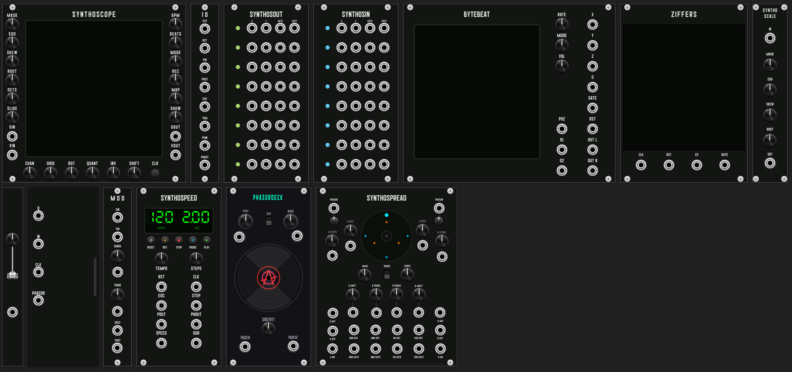
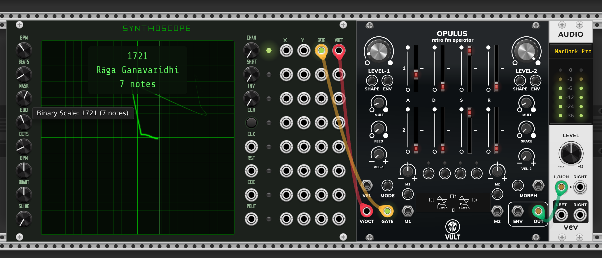
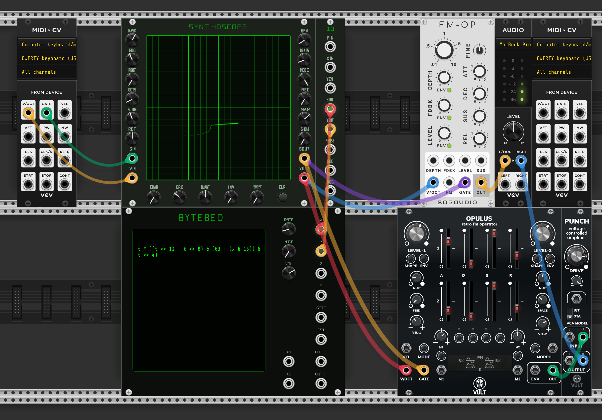
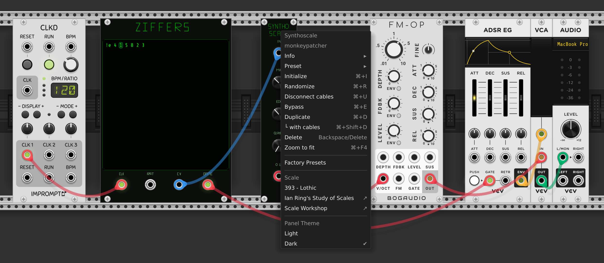

# monkeypatcher

Experimental prototype monkeypatcher modules for VCVRACK2. Released for testing and feedback:

# Installation

This prototype is distributed as .vcvplugin file. Download the monkeypatcher-2.0.0-mac-arm64.vcv file and store it to your vcv2 plugins directory:

* MacOS: ~/Library/Application Support/Rack2/
* Windows: C:\Users\<username>\AppData\Local\Rack2\
* Linux: ~/.local/share/Rack2/

Rack will extract and load the plugin upon launch.

See Official docs for third-party plugins: https://vcvrack.com/manual/Installing#Installing-plugins-not-available-on-the-VCV-Library

Its all fine. Trust the monkey.

# Included modules

## Synthoscope

Funny isometric xy scale pad based on synthoscope.com

## IO & MOD & IN & OUT

Synthoscope extenders for more features, input and output ports

## Synthospeed

Master clock and phasor generator to create and manipulate phasor functions. Extender for Synthoscope and Ziffers modules.

## Bytebed

Funky bytebeat interpreter based on bytebed.com. Can be used with Synthoscope using MOD extenders X&Y out.

## Ziffers

Modular version of Ziffers - The numerical live coding notation. Can be used with Synthospeed for tempo and sync control with phasor automatically connected.

Base 62 variant notation for pitch classes / scale degrees (0..Z = 0..9, a-z, A-Z).

Durations denoted with !-mark and fractions, decimals or characters (q, w, e, s, etc.), for example !1/4, !0.25 or !q.

Outputs chromatic V/OCT by default, can be quantized using Synthoscale.

## Synthoscale

Standalone binary mask scale quantizer for binary and MOS scales. Designed especially for Ziffers live coding module, but works also with external gear using MIDI->CV and with other sequencers, like Seq-3 as well.

## Spider

If the standard Cable Spaghetti is not enough - The Spider can help to make a web of connected knobs that can be tweaked using the knob on Spider module.

## Phasordeck

Errr ... temporal DJ deck for phasors for going back and forth in time. Inputs standard 0-10V phasor and output the time all mangled up.

## Synthospread

Euclidean function generator. Inputs phasors and outputs functions or gate signals. Very WIP - but promising.

## Bytedream

Minimalistic visualization generator based on [bitfielder](https://git.raphaelforment.fr/BuboBubo/bitfielder). Very WIP and vibed.

# Credits

* Source for 12edo scale names and inspiration: [Ian Ring's Study of Scales](https://ianring.com/musictheory/scales/)
* MOS scale theory: [The Wilson Archives](https://www.anaphoria.com/wilson.html)